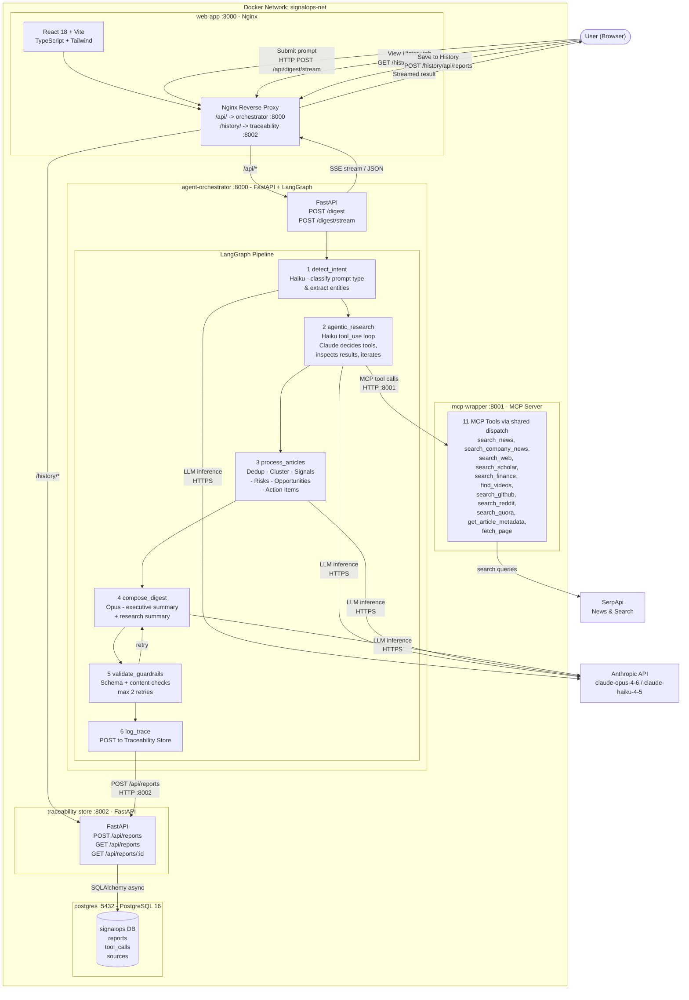

```mermaid
graph TD
    %% ── External actors ──────────────────────────────────────────────
    User(["User (Browser)"])
    Anthropic["Anthropic API\nclaude-opus-4-6 / claude-haiku-4-5"]
    SerpApi["SerpApi\nNews & Search"]

    %% ── Docker stack (signalops-net) ─────────────────────────────────
    subgraph Docker ["Docker Network: signalops-net"]
        direction TB

        subgraph WebApp ["web-app :3000 - Nginx"]
            UI["React 18 + Vite\nTypeScript + Tailwind"]
            Nginx["Nginx Reverse Proxy\n/api/ -> orchestrator :8000\n/history/ -> traceability :8002"]
            UI --> Nginx
        end

        subgraph Orchestrator ["agent-orchestrator :8000 - FastAPI + LangGraph"]
            direction TB
            OrcAPI["FastAPI\nPOST /digest\nPOST /digest/stream"]

            subgraph Pipeline ["LangGraph Pipeline"]
                N1["1 detect_intent\nHaiku - classify prompt type\n& extract entities"]
                N2["2 agentic_research\nHaiku tool_use loop\nClaude decides tools,\ninspects results, iterates"]
                N4["3 process_articles\nDedup - Cluster - Signals\n- Risks - Opportunities\n- Action Items"]
                N5["4 compose_digest\nOpus - executive summary\n+ research summary"]
                N6["5 validate_guardrails\nSchema + content checks\nmax 2 retries"]
                N7["6 log_trace\nPOST to Traceability Store"]
                N1 --> N2 --> N4 --> N5 --> N6 --> N7
                N6 -->|retry| N5
            end

            OrcAPI --> N1
        end

        subgraph MCPWrapper ["mcp-wrapper :8001 - MCP Server"]
            MCP["11 MCP Tools via shared dispatch\nsearch_news, search_company_news,\nsearch_web, search_scholar,\nsearch_finance, find_videos,\nsearch_github, search_reddit,\nsearch_quora, get_article_metadata,\nfetch_page"]
        end

        subgraph TraceStore ["traceability-store :8002 - FastAPI"]
            TSApi["FastAPI\nPOST /api/reports\nGET /api/reports\nGET /api/reports/:id"]
        end

        subgraph DB ["postgres :5432 - PostgreSQL 16"]
            PG[("signalops DB\nreports\ntool_calls\nsources")]
        end
    end

    %% ── Request flows ────────────────────────────────────────────────
    User -->|"Submit prompt\nHTTP POST /api/digest/stream"| Nginx
    Nginx -->|"/api/*"| OrcAPI
    Nginx -->|"/history/*"| TSApi

    N2 -->|"MCP tool calls\nHTTP :8001"| MCP
    MCP -->|"search queries"| SerpApi

    N1 & N2 & N4 & N5 -->|"LLM inference\nHTTPS"| Anthropic

    N7 -->|"POST /api/reports\nHTTP :8002"| TSApi
    TSApi -->|"SQLAlchemy async"| PG

    OrcAPI -->|"SSE stream / JSON"| Nginx
    Nginx -->|"Streamed result"| User

    %% ── History read path ────────────────────────────────────────────
    User -->|"View History tab\nGET /history/api/reports"| Nginx
    User -->|"Save to History\nPOST /history/api/reports"| Nginx
```
